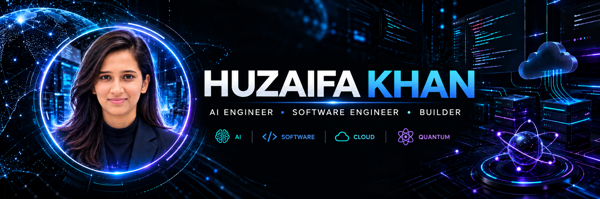

<!-- ========================================================= -->
<!--                        HERO                                -->
<!-- ========================================================= -->

  

  

  

---

<!-- ========================================================= -->
<!--                 CORE IDENTITY                              -->
<!-- ========================================================= -->

# ⚡ AI × SOFTWARE × CLOUD × QUANTUM

### Building intelligent systems that move from **idea → architecture → implementation → impact.**

 

`🤖 Artificial Intelligence`
&nbsp;&nbsp;×&nbsp;&nbsp;
`💻 Software Engineering`
&nbsp;&nbsp;×&nbsp;&nbsp;
`☁️ Cloud & Data`
&nbsp;&nbsp;×&nbsp;&nbsp;
`⚛️ Quantum`

---
<!-- ========================================================= -->
<!--                      ABOUT ME                              -->
<!-- ========================================================= -->

## 👋 Hey, I'm Huzaifa

### **Computer Engineer • AI Engineer • Software Engineer • Builder**

 

 

I'm passionate about turning **ambitious ideas into intelligent, scalable and real-world technology**.

I enjoy working across the entire engineering lifecycle:

`💡 IDEA`
&nbsp; → &nbsp;
`🏗️ ARCHITECTURE`
&nbsp; → &nbsp;
`⚙️ ENGINEERING`
&nbsp; → &nbsp;
`☁️ DEPLOYMENT`
&nbsp; → &nbsp;
`🚀 IMPACT`

 

<table align="center">
<tr>

<td align="center" width="20%">

### 🤖
**AI / ML**

Machine Learning  
Deep Learning  
Computer Vision

</td>

<td align="center" width="20%">

### 🧠
**GEN AI**

LLMs  
RAG  
AI Agents

</td>

<td align="center" width="20%">

### 💻
**SOFTWARE**

Backend  
APIs  
System Design

</td>

<td align="center" width="20%">

### ☁️
**CLOUD & DATA**

AWS  
Snowflake  
Data Engineering

</td>

<td align="center" width="20%">

### ⚛️
**QUANTUM**

Qiskit  
Quantum Computing  
PQC

</td>

</tr>
</table>

 

---
<!-- ========================================================= -->
<!--                  PROOF OF WORK                             -->
<!-- ========================================================= -->

## 🏆 Proof of Work

| 🏅 Achievement | Result |
|---|---|
| 🥇 **Quantum Arena 1.0** | **Winner — National Quantum Computing Hackathon** |
| 🥈 **Hero IIC 2K26** | **Runner-Up — International Hackathon** |
| 🚀 **ISRO Bharatiya Antariksha Hackathon 2025** | **Top 10 Nationwide** |
| 🔥 **Meta Hacker Cup 2025** | **Global Rank #141 — Top 1.5%** |
| ⭐ **Flipkart GRID 8.0** | **Semifinalist — 165K+ Participants** |
| 👨‍💻 **CodeChef** | **3★ Coder — Global Rank #94** |
| 🧩 **LeetCode** | **250+ Problems Solved** |

---

<!-- ========================================================= -->
<!--                  FEATURED PROJECTS                          -->
<!-- ========================================================= -->

## 🚀 Featured Work

<table>
<tr>

<td width="50%" valign="top">

### 🔥 ForeGuard AI

**AI-Based Forest Fire Spread Prediction & Simulation**

`U-Net` `LSTM` `GNN` `Cellular Automata`

🏆 **ISRO Hackathon — Top 10 Nationwide**

AI-driven modeling and prediction of forest-fire propagation.

</td>

<td width="50%" valign="top">

### ⚛️ QuMail

**Quantum-Secure Email Client**

`Qiskit` `Python` `PQC` `Cryptography`

Exploring quantum digital signatures and next-generation secure communication.

</td>

</tr>

<tr>

<td width="50%" valign="top">

### 📦 Smart Warehouse

**AI-Powered Supply Chain Optimization**

`GenAI` `AI Agents` `FastAPI` `Node.js` `MongoDB`

Intelligent recommendations designed for real-world logistics and supply-chain decisions.

</td>

<td width="50%" valign="top">

### 🛒 ProductHub

**AI-Powered Enterprise Product Platform**

`.NET` `ASP.NET Core` `Web API` `MVC` `Azure OpenAI`

Combining enterprise software engineering with Generative AI.

</td>

</tr>

<tr>

<td colspan="2" align="center">

### 📊 E-Commerce Data Engineering Platform

`Amazon S3` → `Snowflake` → `dbt` → `SQL` → `Analytics`

Modern cloud-native data pipeline built around real-world e-commerce data.

</td>

</tr>

</table>

---

<!-- ========================================================= -->
<!--                    TECHNOLOGY                              -->
<!-- ========================================================= -->

## 🧠 Technology Stack

### 🤖 AI / Machine Learning

  

`Machine Learning` · `Deep Learning` · `Computer Vision` · `Transfer Learning`

  

### 🧠 Generative AI

`LangChain` · `LangGraph` · `RAG` · `AI Agents` · `OpenAI` · `Gemini`

  

### 💻 Software Engineering

  

`REST APIs` · `Backend Development` · `MVC` · `Entity Framework` · `System Design`

  

### ☁️ Cloud & Data

 

`Amazon S3` · `Snowflake` · `dbt` · `SQL` · `Data Warehousing` · `Data Pipelines`

  

### 🚀 DevOps

  

`CI/CD` · `Docker` · `Cloud Deployment` · `Version Control`

  

### ⚛️ Quantum & Security

`Qiskit` · `Quantum Computing` · `Quantum Cryptography` · `Post-Quantum Cryptography`

---

<!-- ========================================================= -->
<!--                COMPETITIVE PROGRAMMING                     -->
<!-- ========================================================= -->

## 🧩 Competitive Programming

 

  

---

<!-- ========================================================= -->
<!--                   GITHUB ANALYTICS                         -->
<!-- ========================================================= -->

## 📊 GitHub Analytics

 

  

---

<!-- ========================================================= -->
<!--                CURRENTLY EXPLORING                         -->
<!-- ========================================================= -->

## 🔭 Currently Exploring

---

<!-- ========================================================= -->
<!--                    ENGINEERING MINDSET                     -->
<!-- ========================================================= -->

## ⚡ Engineering Mindset

### **Concept → Architecture → Code → Deployment → Impact**

 

**Build systems. Solve problems. Learn continuously.**

---

<!-- ========================================================= -->
<!--                       CONNECT                              -->
<!-- ========================================================= -->

## 🤝 Let's Connect

  

### 🚀 BUILD. BREAK. LEARN. REPEAT.

*Turning ideas into intelligent systems and real-world software.*

  

