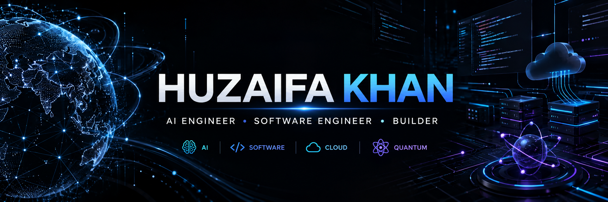

---

## 👋 Hey, I'm Huzaifa

I'm a Computer Engineering student and an **AI-focused Software Engineer** passionate about turning ambitious ideas into real-world technology.

I build at the intersection of **Artificial Intelligence, Software Engineering and Cloud**, with a growing focus on modern data platforms and emerging technologies.

- 🤖 Building **AI/ML, Generative AI & AI Agents**
- 💻 Engineering **scalable backend systems & APIs**
- ☁️ Exploring **AWS, Azure, Snowflake & modern data engineering**
- ⚛️ Exploring **Quantum Computing & Post-Quantum Cryptography**
- 🚀 Hackathon enthusiast & competitive programmer
- 🧩 I enjoy turning complex problems into working products

---

### ⚡ AI × SOFTWARE × CLOUD × QUANTUM

